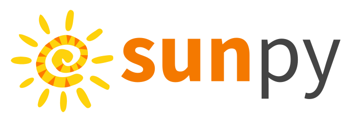

# SunPy hands-on tutorial — ESPD Summer School 2026

<div>

</div>

This repository hosts the notebooks for the SunPy hands-on session at the **2nd European Solar Physics Division (ESPD) Summer School**, Dubrovnik, Croatia, **27 April – 1 May 2026** ([school webpage](https://oh.geof.unizg.hr/index.php/en/meetings/espd-school-2026)).

The session runs **Monday 27 April, 14:30–17:30** (split by a coffee break) and is the first hands-on of the week. By the end you'll be able to query, load, and analyse multi-instrument solar data with SunPy and its affiliated packages, and you'll have a working toolkit for Thursday's project session.

---

## Resources

* [sunpy.org](https://sunpy.org/)
* [SunPy documentation](https://docs.sunpy.org/en/stable/)
* [Affiliated packages](https://sunpy.org/project/affiliated.html)
* [Example gallery](https://docs.sunpy.org/en/stable/generated/gallery/index.html)
* [Matrix chat](https://openastronomy.element.io/#/room/#sunpy:openastronomy.org)
* [OpenAstronomy Discourse](https://community.openastronomy.org/c/sunpy/5)

---

## Notebook overview

| # | Notebook | What it covers |
|---|---|---|
| 01 | `01_solar_data_search.ipynb` | `Fido`: searching and downloading data from any solar archive |
| 02 | `02_data_containers.ipynb` | `Map` and `TimeSeries`: the containers sunpy uses |
| 03 | `03_coordinates_framework.ipynb` | `SkyCoord` and solar frames: the glue between observations |
| 04 | `04_example_workflow.ipynb` | End-to-end multi-instrument analysis of the 2022-04-02 M-class flare |

All four built around one real solar event — an M-class flare on 2022-04-02 from active region 12975, observed by SDO/AIA, SOHO/LASCO, and Solar Orbiter (EUI / STIX). The 15-min opening lecture content lives as the markdown header of Notebook 1.

---

## How to run

You have two paths: **Google Colab** (zero install) or **local install** (recommended for the in-person school).

### Path A — Google Colab

Click the badge for the notebook you want and it opens in Colab with everything you need:

| Notebook | Open in Colab |
|---|---|
| `01_solar_data_search.ipynb` | [](https://colab.research.google.com/github/hayesla/ESPDSummerSchoolSunPy2026/blob/main/notebooks/01_solar_data_search.ipynb) |
| `02_data_containers.ipynb` | [](https://colab.research.google.com/github/hayesla/ESPDSummerSchoolSunPy2026/blob/main/notebooks/02_data_containers.ipynb) |
| `03_coordinates_framework.ipynb` | [](https://colab.research.google.com/github/hayesla/ESPDSummerSchoolSunPy2026/blob/main/notebooks/03_coordinates_framework.ipynb) |
| `04_example_workflow.ipynb` | [](https://colab.research.google.com/github/hayesla/ESPDSummerSchoolSunPy2026/blob/main/notebooks/04_example_workflow.ipynb) |

The first cell of every notebook detects Colab and `pip install`s the required packages for you (~2 min the first time).

> **Heads-up about Colab and data**: each notebook fetches the data it needs at the top. Files don't persist between Colab notebook sessions, so each notebook re-fetches what it needs — slower but works. On a local install, the `data/` directory is shared across notebooks, so files only download once. If you can install locally before Monday, that's the smoother experience.

### Path B — Local install (recommended)

#### 1. Clone the repo

```bash
git clone https://github.com/hayesla/ESPDSummerSchoolSunPy2026.git
cd ESPDSummerSchoolSunPy2026
```

#### 2. Create the environment

With **conda** (Miniconda or Anaconda):

```bash
conda env create -f environment.yml
conda activate espd-sunpy-2026
```

If solving feels slow, you can speed conda up by installing the libmamba solver once: `conda install -n base conda-libmamba-solver && conda config --set solver libmamba`.

Or with **mamba** ([a fast conda drop-in replacement](https://mamba.readthedocs.io/)):

```bash
mamba env create -f environment.yml
mamba activate espd-sunpy-2026
```

If you don't use conda/mamba, a plain virtualenv works:

```bash
python -m venv .venv
source .venv/bin/activate     # Windows: .venv\Scripts\activate
pip install -r requirements.txt
```

#### 3. Launch JupyterLab

```bash
jupyter lab
```

This should open in your browser — start with `notebooks/01_solar_data_search.ipynb`.

---

## Pre-session checklist

Before you arrive on Monday (or before you connect online), please run through this:

1. Clone the repo and create the environment (see above).
2. Open `notebooks/01_solar_data_search.ipynb` and run the first cell (the imports). You should see SunPy version 7.1 or newer, and no errors.
3. Run the second cell (a small `Fido` query). If this errors, you probably have a network/proxy issue — try Colab as a backup.

If anything fails, check the [issues](https://github.com/hayesla/ESPDSummerSchoolSunPy2026/issues) page or ping me on the school's communication channel.

---

## What's new vs the 2024 version

If you took the [2024 ESPD SunPy tutorial](https://github.com/hayesla/ESPDSummerSchoolSunPy):

- **Same four-notebook structure** (Search/Download → Containers → Coordinates → Workflow) and the **same 2022-04-02 case-study event** — the flow that worked in 2024.
- **Updated for sunpy 7** — sunpy 7.1, aiapy 0.11 (with the new explicit-table API for AIA prep), sunpy-soar registered as a `Fido` plugin, sunkit-image enhancement filters.
- **More detailed prose** explaining clients, attrs, indexing, and the `{file}` template — fewer "magic" surprises.
- **Substantially expanded coordinates notebook** — observer-position diagram, frame-class-vs-instance distinction, `propagate_with_solar_surface`, `SphericalScreen` for off-disk crops.
- **Embedded exercises** in each notebook with hints and collapsible solutions.
- **`site='NSO'` for AIA fetches** to avoid the JSOC default-mirror timeouts.

---

## Credits

Tutorial by **Laura A. Hayes** (Dublin Institute for Advanced Studies, Ireland), building on the 2024 version with thanks to the **SunPy community** and contributors to all the affiliated packages used here: `aiapy`, `sunpy-soar`, `sunkit-instruments`, `sunkit-image`, `reproject`, and `astropy`.

Released under the [BSD 3-Clause License](LICENSE).
